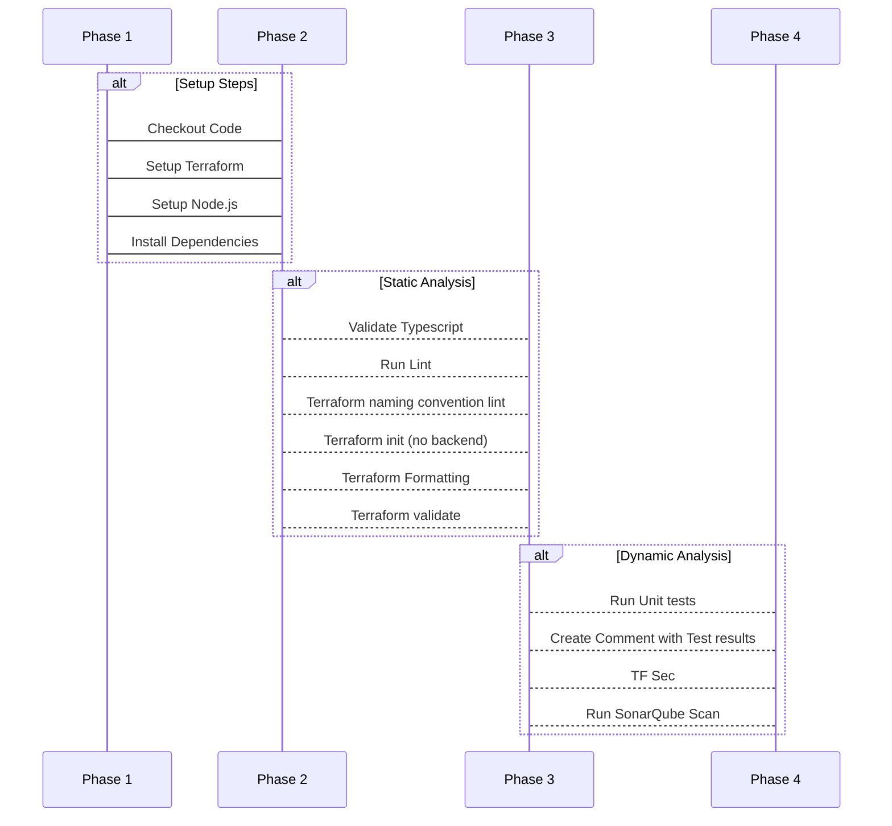

## Pipelines

### Semantic Release

### PRs

The PR pipeline in this repository is defined in [./.github/workflows/pr.yml](./workflows/pr.yml), it consists of the following flow

  
Step summaries

- Checkout Code: This step checks out the code from the GitHub repository.

- Setup Terraform: This step sets up Terraform in the checked-out code.

- Setup Node.js: This step sets up the Node.js environment for the repository.

- Install Dependencies: This step installs any dependencies required by the code in the repository, such as package.json files managed by npm (Node Package Manager).

- Validate Typescript: This step runs a TypeScript validation process to check for errors or warnings in the TypeScript code. This ensures that the code is syntactically correct and free of type-related issues.

- Run Lint: This step runs ESLint, a popular JavaScript linter, to analyze the code and report any syntax errors, styling issues, or other potential problems.

- Terraform naming convention lint: This step runs a custom script or tool (likely using Terraform's built-in formatting features) to enforce consistent naming conventions for Terraform files and resources.

- Terraform init (no backend): As mentioned earlier, this step initializes the Terraform environment without setting up a remote state storage service. This allows Terraform to run in "local" mode, as described above.

- Terraform Formatting: This step reformats the Terraform code according to your team's preferred style and naming conventions. This ensures consistency across your infrastructure-as-code configuration files.

- Terraform validate: This step runs Terraform's built-in validation process to check for errors or warnings in the Terraform configuration files. This helps catch any potential issues with resource definitions, dependencies, or other aspects of the infrastructure-as-code setup.

- Run Unit tests: This step executes unit tests for the code in the repository. These tests verify that individual components or features work as expected and help ensure the overall quality of the codebase.

- Create Comment with Test results: After running the unit tests, this step creates a comment summarizing the test results. This allows reviewers to quickly see whether the code passes or fails its automated testing regimen.

- TF Sec: This step runs Terraform's built-in security scanning and analysis tools (Terraform Security) to identify potential security vulnerabilities in your infrastructure-as-code configuration files.

- Checkov GitHub Action: This step uses Checkov, a popular open-source tool for evaluating cloud infrastructure configurations, to analyze the Terraform code and report on any potential security or compliance issues. The results are likely displayed as a GitHub Action status check.

- Run SonarQube Scan: Finally, this step runs a SonarQube scan to analyze the code for quality and security issues. SonarQube provides detailed reports on code smells, bugs, vulnerabilities, and other metrics to help you maintain high-quality software development practices.

