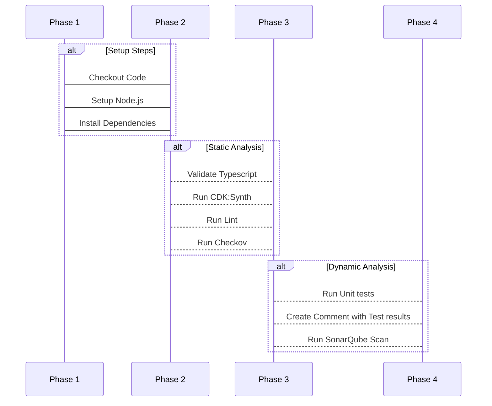
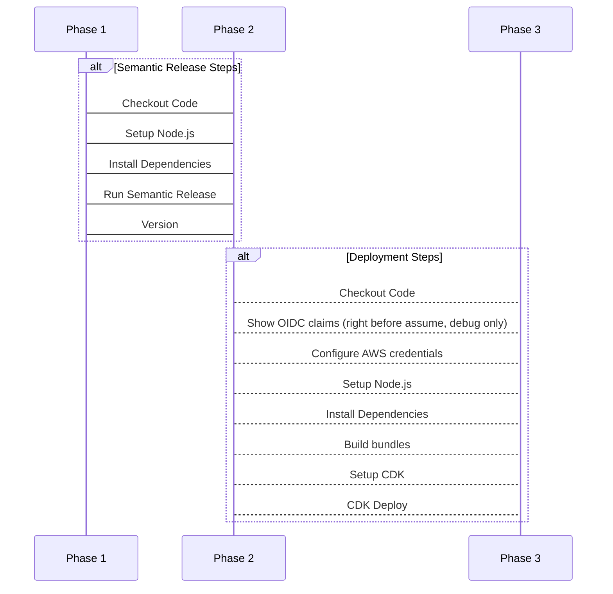
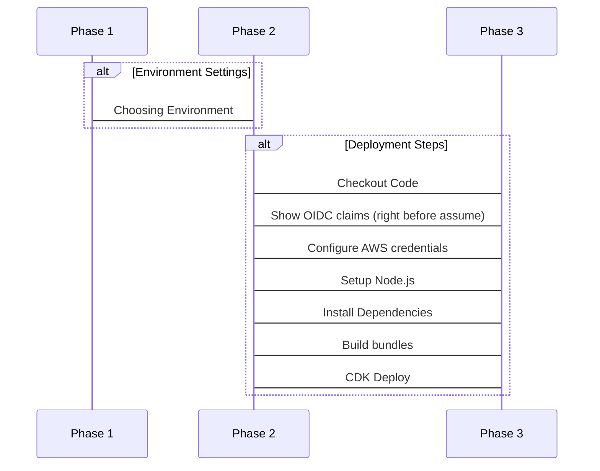

# Deployment Guide

CI/CD pipelines, environments and deployment workflows for the GDS Unified Notification Service.

---

## Overview

The service deploys as a single CDK stack (`UNSStack` — see the [Infrastructure Development Guide](./infrastructure-development.md)) containing both the PSO and Flex services. There is no per-domain or per-service split at the deploy level: one `cdk deploy` ships everything.

### Environments

| Environment | `env` value (CDK) | GitHub Environment name | Persistence | Deployed by |
| ----------- | ------------------ | -------------------------- | ------------- | ----------------------------------- |
| Personal sandbox | `<you>-<hash>` | — | Ephemeral | You, via `pnpm run development:sandbox:release` |
| Development | `dev` | `dev` | Persistent | CI/CD (`main.release.yml`, or manually) |
| Staging | `stg` | `staging` | Persistent | CI/CD (`main.release.yml`, or manually) |
| Production | `prod` | `production` | Persistent | CI/CD (`main.release.yml`, or manually) |

The CDK-internal `env` value and the GitHub Environment name differ (`stg`/`prod` vs `staging`/`production`) — the reusable [`_deploy.yml`](/.github/workflows/_deploy.yml) workflow bridges them via a GitHub Environment variable, `ENVIRONMENT_SHORTHAND`, passed into the CDK deploy as the `env` process environment variable. See [`infrastructure/cdk/config.ts`](/infrastructure/cdk/config.ts) for how `env` drives resource naming and which environments are treated as persistent (`unremoveableEnvironments = ['dev','stg','prod']`).

> Unlike some sibling GOV.UK Once services, **pull requests do not get an ephemeral deployed environment.** The PR pipeline runs a CDK synth against mocked credentials (see [Quality Checks](#quality-checks-pryml) below) to validate the stack builds, but nothing is deployed until the change merges to `main`.

Personal sandboxes import shared infrastructure (VPC, mTLS certificate authority, revocation table) from the `dev` environment via SSM rather than provisioning their own — see [Infrastructure Development Guide: Sandbox environments](./infrastructure-development.md#sandbox-environments).

---

## Personal sandbox

Deploy your own stack for local development and testing.

### Prerequisites

Complete the [Environment Setup](./environment-setup.md) steps first, including `pnpm run development:sandbox:setup`.

### Deploy

```sh
pnpm run development:sandbox:release   # build + cdk deploy
pnpm run development:sandbox:plan      # build + cdk diff (preview only, no changes applied)
```

These map to `pnpm run build && pnpm run cdk:deploy` / `pnpm run cdk:diff` respectively — see [`package.json`](/package.json). `cdk:deploy` itself runs three steps in sequence:

```sh
pnpm run cdk:predeploy:ssm   # ensure operator-configurable SSM parameters exist (tsx infrastructure/cdk/cdk.predeploy.ssm.ts)
pnpm run cdk deploy --require-approval never --import-existing-resources true
pnpm run cdk:postdeploy:ssm  # write the Flex private API key/URL into Secrets Manager (tsx infrastructure/cdk/cdk.postdeploy.ssm.ts)
```

The pre/post SSM steps exist so CDK never owns values that need to change independently of a deploy (feature flags, dispatch adapter config) or that can't safely be expressed as CloudFormation tokens (a freshly generated API Gateway API key) — see [Infrastructure Development Guide: SSM parameter conventions](./infrastructure-development.md#ssm-parameter-conventions).

### Verify

```sh
pnpm test          # full suite (unit + e2e) against your sandbox
env=<your-env> pnpm run test:e2e   # e2e only, if `env` differs from what your shell already has set
```

### Destroy

There is no dedicated `destroy` script; use the CDK CLI directly:

```sh
pnpm run cdk destroy
```

---

## Persistent environments

Persistent environments (`dev`, `staging`, `production`) deploy via CI/CD only — see [Environment Setup: AWS credentials](./environment-setup.md#aws-credentials) if you need read access to inspect them, but there is no supported path for deploying to them from a local machine outside a break-glass incident.

---

## CI/CD workflows

### Quality Checks (`pr.yml`)

**Trigger:** pull request opened or updated against `main`.

Runs TypeScript validation, the Lambda build, lint, unit tests with coverage, a mock-credentials CDK synth, a soft-fail Checkov scan, and a soft-fail SonarQube scan — see the full step-by-step breakdown in [`.github/README-Pipelines.md`](/.github/README-Pipelines.md#prs). Only TypeScript validation, the build, lint and the initial `test:unit` run genuinely fail the job; Checkov (`soft_fail: true`) and both Sonar steps (`continue-on-error: true`) are informational within the workflow itself. Whatever merge-blocking actually happens is enforced by GitHub branch protection rules requiring specific status checks, which — like Environment protection rules — live in repository settings rather than in a workflow file.

No deploy happens here; the CDK synth step explicitly blanks AWS credentials (`AWS_ACCESS_KEY_ID=""` etc.) so it can validate the stack builds without assuming a role.



<details>
  <summary>Step summaries</summary>

- Checkout Code: This step checks out the code from the GitHub repository.

- Setup Node.js: This step sets up the Node.js environment for the repository.

- Install Dependencies: This step installs any dependencies required by the code in the repository, such as package.json files managed by pnpm (Node Package Manager).

- Validate Typescript: This step runs a TypeScript validation process to check for errors or warnings in the TypeScript code. This ensures that the code is syntactically correct and free of type-related issues.

- Run Lint: This step runs ESLint, a popular JavaScript linter, to analyze the code and report any syntax errors, styling issues, or other potential problems.

- Run Unit tests: This step executes unit tests for the code in the repository. These tests verify that individual components or features work as expected and help ensure the overall quality of the codebase.

- Create Comment with Test results: After running the unit tests, this step creates a comment summarizing the test results. This allows reviewers to quickly see whether the code passes or fails its automated testing regimen.

- Checkov GitHub Action: This step uses Checkov, a popular open-source tool for evaluating cloud infrastructure configurations, to analyze the CDK code and report on any potential security or compliance issues. The results are likely displayed as a GitHub Action status check.

- Run SonarQube Scan: Finally, this step runs a SonarQube scan to analyze the code for quality and security issues. SonarQube provides detailed reports on code smells, bugs, vulnerabilities, and other metrics to help you maintain high-quality software development practices.

</details>

### Release (`main.release.yml`)

**Trigger:** push to `main` (i.e. every merged PR).

Runs [semantic-release](https://github.com/semantic-release/semantic-release) to compute and tag the next version (see the [Releases Guide](./releases.md)), then deploys `dev`, then `staging` and `production` in parallel — see [Deployment flow](#deployment-flow) above. Each environment deploy is the reusable [`_deploy.yml`](#reusable-deploy-workflow) workflow.



<details>
  <summary>Step summaries</summary>

- Checkout Code: This step checks out the code from the GitHub repository for the semantic release.

- Setup Node.js: This step sets up the Node.js environment for the repository for the semantic release.

- Install Dependencies: This step installs any dependencies required by the code in the repository, such as package.json files managed by pnpm (Node Package Manager) for the semantic release.

- Run Semantic Release: Determines the next semantic version number based on the commit messages and tags the release with the version.

- Version: Outputs the semantic version number to the pipeline console.

- Checkout Code: This step checks out the code from the GitHub repository for the deployment.

- Show OIDC claims: Outputs the OIDC claim before configuring AWS credentials (only used in debugger).

- Configure AWS credentials: Uses the OIDC claim to authenticate to AWS.

- Setup Node.js: This step sets up the Node.js environment for the repository for the deployment.

- Install Dependencies: This step installs any dependencies required by the code in the repository, such as package.json files managed by pnpm (Node Package Manager) for the deployment.

- Build bundles: This step installs any dependencies required by the code in the repository, such as package.json files managed by pnpm (Node Package Manager) for the deployment.

</details>

### Manual Deployment (`manual.deploy.yml`)

**Trigger:** `workflow_dispatch`, with three independent boolean inputs — `deploy_to_dev`, `deploy_to_stg`.

Deploys any combination of environments without cutting a new release, useful for re-deploying the current `main` (e.g. after a failed run, or to pick up an SSM-driven config change) or for a rollback via a revert commit already on `main`. Selected environments deploy independently and in parallel — there's no `dev`-first ordering here, unlike the automatic release pipeline. Each triggers [`_deploy.yml`](#reusable-deploy-workflow) directly with `VERSION: ${{ github.ref_name }}@${{ github.sha }}` rather than a semantic-release version, since no release step runs.



<details>
  <summary>Step summaries</summary>

- Choosing Environment: Chooses which environment to deploy the build to.

- Show OIDC claims: Outputs the OIDC claim before configuring AWS credentials (only used in debugger).

- Configure AWS credentials: Uses the OIDC claim to authenticate to AWS.

- Setup Node.js: This step sets up the Node.js environment for the repository.

- Install Dependencies: This step installs any dependencies required by the code in the repository, such as package.json files managed by pnpm (Node Package Manager).

- Build bundles: This step installs any dependencies required by the code in the repository, such as package.json files managed by pnpm (Node Package Manager).

- Deploy CDK: Trigger

</details>

### Reusable deploy workflow

Both the Release and Manual Deployment pipelines deploy an environment through the shared [`_deploy.yml`](/.github/workflows/_deploy.yml) file, called only via `workflow_call`:

1. Checkout code.
2. Assume the environment's deploy role via OIDC (`secrets.AWS_DEPLOY_ROLE_ARN`), scoped by the GitHub Environment binding described above.
3. Log into the private CodeArtifact npm registry.
4. Install dependencies, build the Lambda bundles (`pnpm run build`).
5. `pnpm run cdk:deploy` against the target environment.
6. Run tests **against the now-deployed environment**: the full suite (`pnpm test`) for `dev`/`staging`, or unit tests only (`pnpm run test:unit`) for `production` — deliberately not exercising e2e writes against production, to avoid shipping test data into analytics.

Note the ordering: the deploy happens *before* the test step, not as a pre-deploy gate — a broken deploy is caught by the deploy itself failing (CloudFormation), while the test step is a post-deploy health check rather than a release gate for `production`.

### Sonar Scan (`main.sonar.yml`)

**Trigger:** push to `main`.

Runs `pnpm run test:coverage` then a SonarQube scan against `main`, independent of the PR-branch scan in `pr.yml`, so SonarCloud's view of the default branch stays current even between PRs (e.g. after a direct commit or a merge from a long-lived branch).

### GitHub Pages (`main.pages.yml`)

**Trigger:** push to `main`.

Publishes the committed [`docs/`](/docs) directory (PSO and Flex OpenAPI specs plus their Swagger UI pages) to GitHub Pages via the standard `configure-pages` → `upload-pages-artifact` → `deploy-pages` action chain. It does **not** generate the OpenAPI specs — `docs/pso/openapi.yml` and `docs/flex/openapi.yml` are committed files, regenerated and updated by hand (or by a separate process outside this workflow) rather than built in CI. See the root [README.md](/README.md#github-pages) for the published URLs.

---

---

## Troubleshooting

### CDK deploy fails referencing a missing VPC, security group, or mTLS truststore

Sandbox environments import these from the `dev` environment via SSM (`/shared/vpc`, `/shared/mtls/*`) rather than creating their own. Confirm `dev` is healthy and those SSM parameters exist — see [Infrastructure Development Guide: Sandbox environments](./infrastructure-development.md#sandbox-environments).

### `cdk:predeploy:ssm` reports a parameter mismatch or the deploy doesn't pick up a config change

Operator-configurable values (feature flags, dispatch/processing adapter selection) live in SSM and are deliberately managed outside CDK by [`cdk.predeploy.ssm.ts`](/infrastructure/cdk/cdk.predeploy.ssm.ts) so CDK won't silently revert manual changes. Set `SSM_PARAMETERS_TO_UPDATE` (as used by `_deploy.yml`) or update the parameter directly if editing by hand between deploys.

### E2E tests fail after a deploy with connection or authentication errors

Check the deployed stack's outputs and, for PSO endpoints specifically, that your mTLS client certificate is current — see [`test/e2e/README.md`](/test/e2e/README.md#prerequisites) and the [Infrastructure Development Guide: mTLS](./infrastructure-development.md#mtls-certificate-infrastructure).

### A deploy fails partway through CloudFormation

CloudFormation should roll back automatically. Check the stack's status via AWS Console.

We fix forward — there is no pipeline step that redeploys a previous commit. Once you understand the cause, the fix goes to `main` as a new commit and runs through the pipeline from the start. See the [Fix Forward Runbook](./runbooks/fix-forward.md).

---

## Related

**Guides:**

- [Environment Setup](./environment-setup.md)
- [Infrastructure Development Guide](./infrastructure-development.md)
- [Releases and Versioning](./releases.md)
- [Runbooks](./runbooks/README.md)
- [.github/README-Pipelines.md](/.github/README-Pipelines.md) — full step-by-step breakdown of every workflow

**Code:**

- [`.github/workflows/_deploy.yml`](/.github/workflows/_deploy.yml)
- [`.github/workflows/pr.yml`](/.github/workflows/pr.yml)
- [`.github/workflows/main.release.yml`](/.github/workflows/main.release.yml)
- [`.github/workflows/manual.deploy.yml`](/.github/workflows/manual.deploy.yml)
- [`infrastructure/cdk/config.ts`](/infrastructure/cdk/config.ts)
