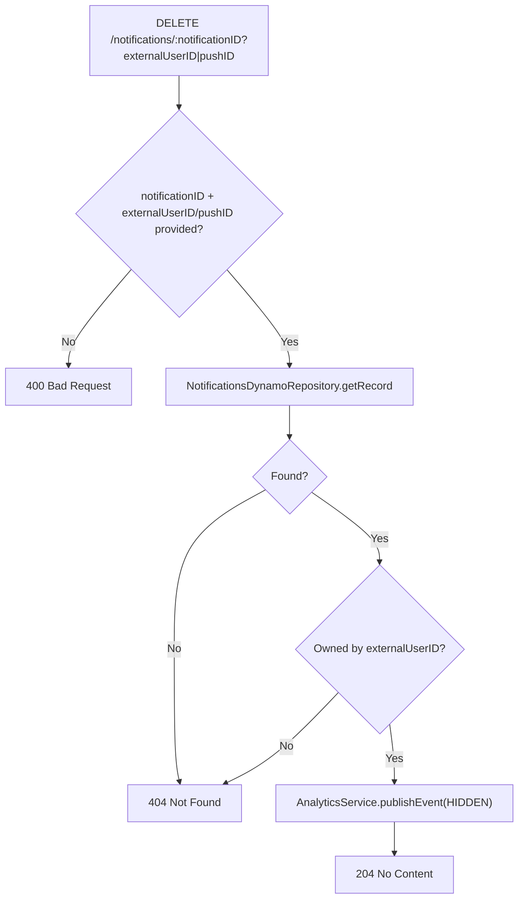

## DeleteNotification

Soft-deletes ("hides") a notification for the requesting user. Like `patchNotification`, the DynamoDB write is asynchronous - this handler validates ownership and publishes a `HIDDEN` analytics event.

- **Type:** HTTP (API Gateway, Flex-private + dev-only public gateway)
- **Operation ID:** `deleteNotification`
- **Route:** `DELETE /notifications/{notificationID}`

### Sample event

```json
{
  "headers": { "x-api-key": "mockApiKey" },
  "requestContext": { "requestId": "c6af9ac6-7b61-11e6-9a41-93e8deadbeef", "requestTimeEpoch": 1428582896000 },
  "pathParameters": { "notificationID": "12342" },
  "queryStringParameters": { "externalUserID": "USER_ID" }
}
```

### Infrastructure

- **DynamoDB** - `NotificationsDynamoRepository` (the Messages table), read-only by ID (ownership check only).
- **SQS** - publishes a `HIDDEN` event to the `analytics` queue via `AnalyticsService`; `sqs.analytics` performs the actual write.

### Logic


