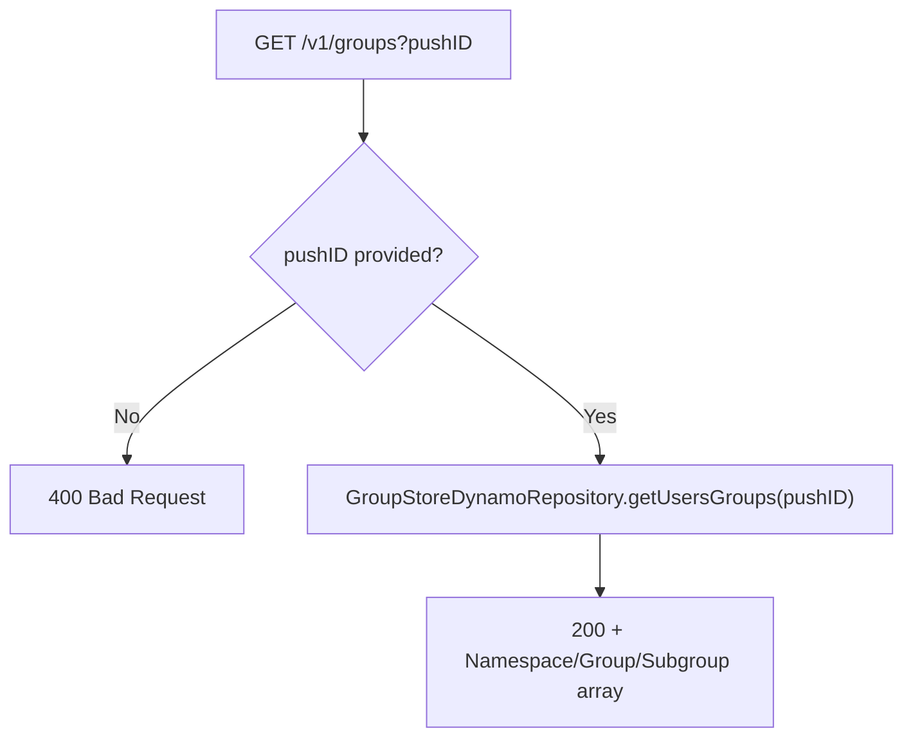

## GetGroups

Feature-flagged (`config.featureFlag.groups`). Returns the list of groups/subgroups a given push ID currently belongs to.

- **Type:** HTTP (API Gateway, Flex-private + dev-only public gateway)
- **Operation ID:** `getGroups`
- **Route:** `GET /v1/groups`

### Sample event

```json
{
  "headers": { "x-api-key": "mockApiKey" },
  "requestContext": { "requestId": "c6af9ac6-7b61-11e6-9a41-93e8deadbeef" },
  "queryStringParameters": { "pushID": "ecc3d3dd-9aa3-4e2c-b4b5-e6e4cf8a439c" }
}
```

### Infrastructure

- **DynamoDB** - `GroupStoreDynamoRepository` (the GroupStore table); IAM grants read+write, but this handler only reads (`getUsersGroups`).

### Logic


