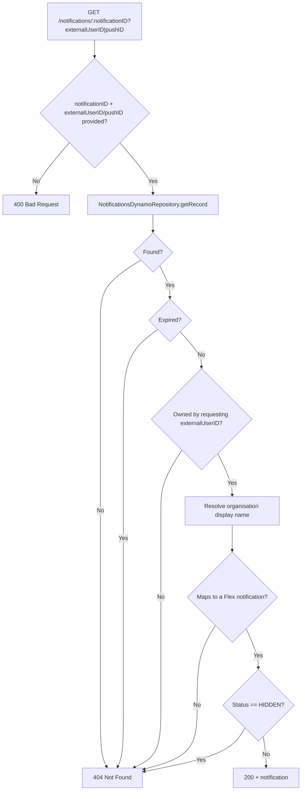

## GetFlexNotificationById

Returns a single notification by ID, scoped to the requesting user, in the Flex API's response shape.

- **Type:** HTTP (API Gateway, Flex-private + dev-only public gateway)
- **Operation ID:** `getNotificationById`
- **Route:** `GET /notifications/{notificationID}`

### Sample event

```json
{
  "headers": { "x-api-key": "mockApiKey" },
  "requestContext": { "requestId": "c6af9ac6-7b61-11e6-9a41-93e8deadbeef", "requestTimeEpoch": 1428582896000 },
  "pathParameters": { "notificationID": "12342" },
  "queryStringParameters": { "externalUserID": "USER_ID" }
}
```

### Infrastructure

- **DynamoDB** - `NotificationsDynamoRepository` (the Messages table), read-only by ID; `OrganisationsDynamoRepository` (the Organisations table), read-only.
- No SQS, no outbound HTTP calls.

### Logic


