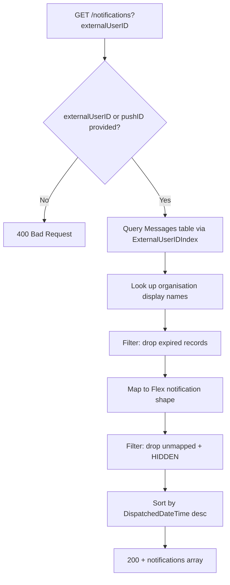

## GetNotifications

Returns the calling user's notifications (by push/external user ID), enriched with organisation display names, with expired and hidden notifications filtered out.

- **Type:** HTTP (API Gateway, Flex-private + dev-only public gateway)
- **Operation ID:** `getNotifications`
- **Route:** `GET /notifications`

### Sample event

```json
{
  "headers": { "x-api-key": "mockApiKey" },
  "requestContext": { "requestId": "c6af9ac6-7b61-11e6-9a41-93e8deadbeef", "requestTimeEpoch": 1428582896000 },
  "queryStringParameters": { "externalUserID": "USER_ID" }
}
```

### Infrastructure

- **DynamoDB** - `NotificationsDynamoRepository` (the Messages table), read-only, queried via the `ExternalUserIDIndex` GSI; `OrganisationsDynamoRepository` (the Organisations table), read-only, for display names.
- No SQS, no outbound HTTP calls.

### Logic


