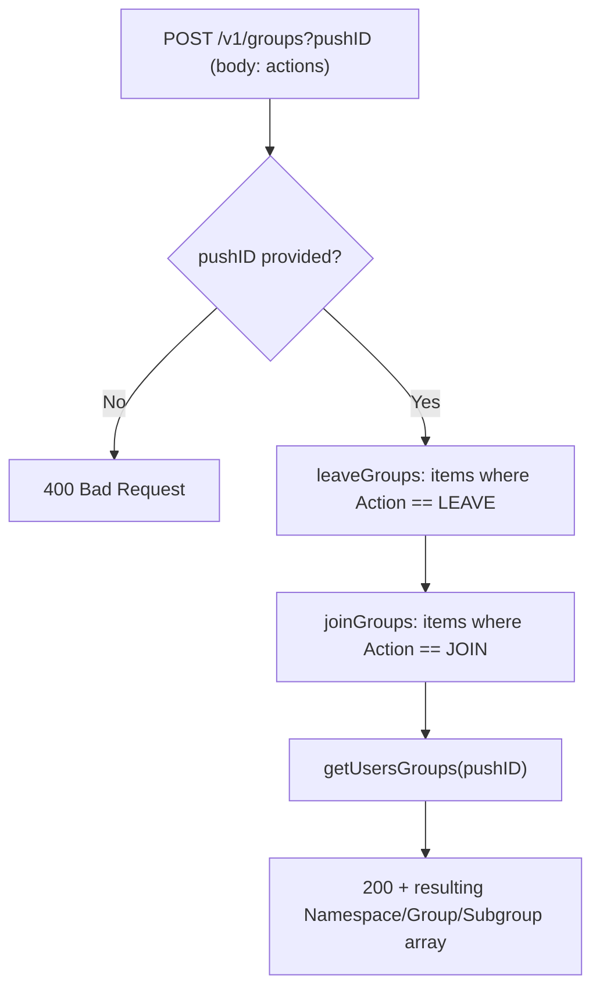

## ModifyGroups

Feature-flagged (`config.featureFlag.groups`). Joins and/or leaves groups on behalf of a push ID, then returns the resulting group membership.

- **Type:** HTTP (API Gateway, Flex-private + dev-only public gateway)
- **Operation ID:** `modifyGroups`
- **Route:** `POST /v1/groups`

### Sample event

```json
{
  "headers": { "x-api-key": "mockApiKey" },
  "requestContext": { "requestId": "c6af9ac6-7b61-11e6-9a41-93e8deadbeef" },
  "queryStringParameters": { "pushID": "ecc3d3dd-9aa3-4e2c-b4b5-e6e4cf8a439c" },
  "body": [
    { "Namespace": "travel", "Group": "france", "Subgroup": "IMMEDIATE", "Action": "JOIN" },
    { "Namespace": "travel", "Group": "spain", "Action": "LEAVE" }
  ]
}
```

### Infrastructure

- **DynamoDB** - `GroupStoreDynamoRepository` (the GroupStore table), read+write (`leaveGroups`, `joinGroups`, `getUsersGroups`).

### Logic


