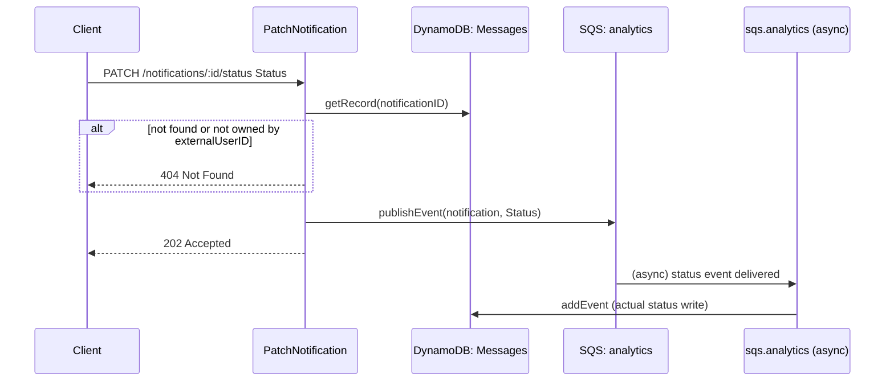

## PatchNotification

Updates a notification's read/unread/received status. The write itself is asynchronous - this handler only validates ownership and publishes an analytics event; `sqs.analytics` performs the actual DynamoDB update.

- **Type:** HTTP (API Gateway, Flex-private + dev-only public gateway)
- **Operation ID:** `patchNotification`
- **Route:** `PATCH /notifications/{notificationID}/status`

### Sample event

```json
{
  "headers": { "x-api-key": "mockApiKey" },
  "requestContext": { "requestId": "c6af9ac6-7b61-11e6-9a41-93e8deadbeef", "requestTimeEpoch": 1428582896000 },
  "pathParameters": { "notificationID": "12342" },
  "queryStringParameters": { "externalUserID": "USER_ID" },
  "body": { "Status": "READ" }
}
```

### Infrastructure

- **DynamoDB** - `NotificationsDynamoRepository` (the Messages table), read-only by ID (ownership check only - no write happens in this lambda).
- **SQS** - publishes to the `analytics` queue via `AnalyticsService`; the actual status write happens downstream in `sqs.analytics` (`NotificationsDynamoRepository.addEvent`).
- Accepted statuses: `READ`, `MARKED_AS_UNREAD`, `RECEIVED` (case-insensitive, uppercased before validation).

### Logic


