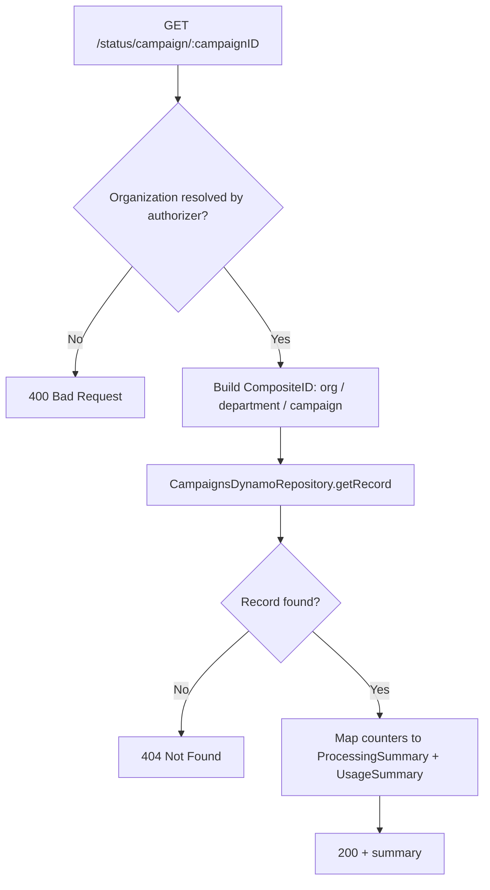

## GetCampaignStatus

Returns aggregate processing/usage counters for a campaign (how many notifications were received/processed/dispatched, and how many were read/hidden/marked unread), scoped to the calling organisation.

- **Type:** HTTP (API Gateway)
- **Operation ID:** `getCampaignStatus`
- **Route:** `GET /status/campaign/{campaignID}`

### Sample event

```json
{
  "pathParameters": { "campaignID": "CAM_ID" },
  "queryStringParameters": { "departmentID": "DEP01" },
  "requestContext": {
    "authorizer": { "Organization": "ORG01" },
    "requestId": "requestID-test"
  }
}
```

### Infrastructure

- **DynamoDB** - `CampaignsDynamoRepository` (the Campaigns table), read-only by ID. The lookup key is a composite ID built from `OrganisationID` (resolved by `MtlsCertificateRevocationAuthorizer`), `departmentID` (query param), and `campaignID` (path param) via `CampaignsDynamoRepository.buildCompositeID`.
- Counters are written into this table by `sqs.analytics` (`CampaignsDynamoRepository.incrementCampaigns`) - this handler only reads them.

### Logic


