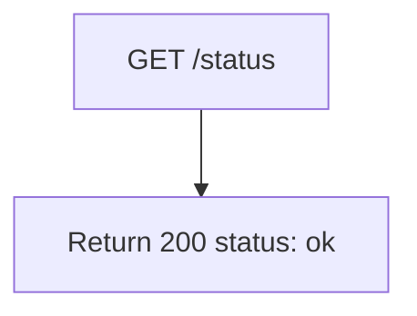

## GetHealthcheck

Liveness probe for the PSO API - always returns `200 { "status": "ok" }` without touching any dependency.

- **Type:** HTTP (API Gateway)
- **Operation ID:** `getHealthcheck`
- **Route:** `GET /status`

### Sample event

```json
{
  "httpMethod": "GET",
  "path": "/status",
  "headers": { "x-api-key": "mockApiKey" },
  "requestContext": { "requestId": "c6af9ac6-7b61-11e6-9a41-93e8deadbeef" }
}
```

### Infrastructure

- No DynamoDB, SQS, Secrets Manager, or external calls - the only resources granted are the baseline SSM namespace read and KMS decrypt every PSO lambda gets (see [`UNSPSOResources.ts`](../../../../infrastructure/cdk/constructs/UNSPSOResources.ts)).
- Does not register any `injectDependencies` factory at all - it's the only PSO/Flex handler with no service dependencies.

### Logic


