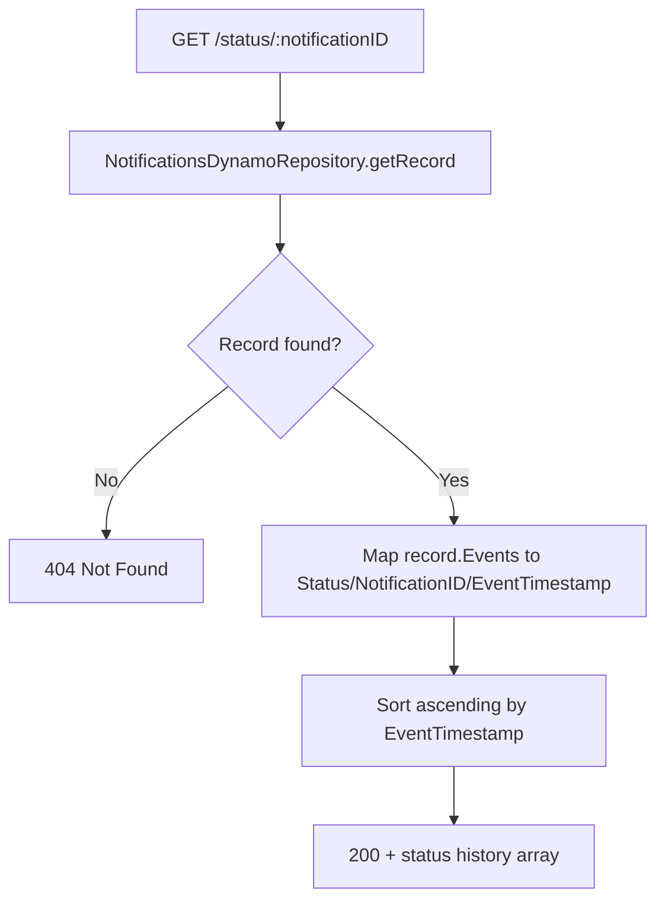

## GetNotificationStatus

Returns the full status/event history of a single notification, keyed by `NotificationID`. Used by PSO consumers to poll delivery/read status.

- **Type:** HTTP (API Gateway)
- **Operation ID:** `getNotificationStatus`
- **Route:** `GET /status/{notificationID}`

### Sample event

```json
{
  "httpMethod": "GET",
  "path": "/status/337f6248-ed5b-4b73-be1b-4e9a2f8636e0",
  "pathParameters": { "notificationID": "337f6248-ed5b-4b73-be1b-4e9a2f8636e0" },
  "headers": { "x-api-key": "mockApiKey" },
  "requestContext": { "requestId": "c6af9ac6-7b61-11e6-9a41-93e8deadbeef" }
}
```

### Infrastructure

- **DynamoDB** - `NotificationsDynamoRepository` (the Messages table), read-only by ID.
- No SQS, no outbound HTTP calls.

### Logic


