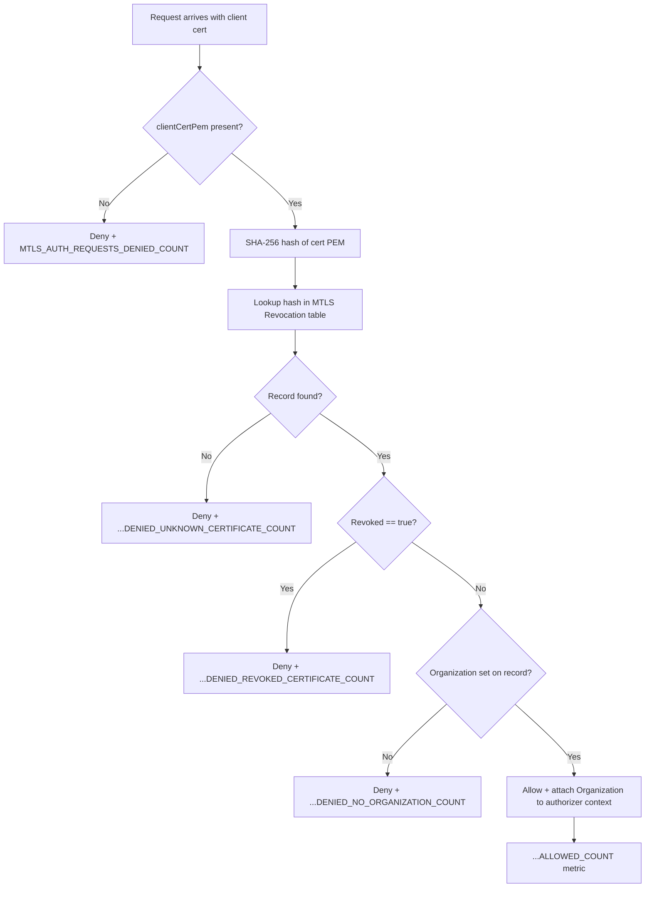

## MtlsCertificateRevocationAuthorizer

API Gateway **REQUEST** Lambda authorizer for the PSO API. Runs ahead of every PSO HTTP route to confirm the mTLS client certificate presented by the caller (already verified against the CA and expiry by API Gateway itself) hasn't been revoked, and to resolve which `Organization` the caller belongs to.

- **Type:** HTTP (API Gateway custom authorizer)
- **Operation ID:** `mtlsApiGatewayAuthorizer`
- **Identity source:** `context.identity.clientCert.clientCertPem`

### Sample event

`APIGatewayRequestAuthorizerEvent`, relevant fields only:

```json
{
  "type": "REQUEST",
  "methodArn": "arn:aws:execute-api:eu-west-2:123456789012:abc123/dev/POST/send",
  "requestContext": {
    "identity": {
      "clientCert": {
        "clientCertPem": "-----BEGIN CERTIFICATE-----\n...\n-----END CERTIFICATE-----"
      }
    }
  }
}
```

### Infrastructure

- **DynamoDB** - `MTLSRevocationDynamoRepository` (the MTLS Revocation table), read-only, keyed by a SHA-256 hash of the certificate PEM.
- **KMS** - decrypt permission on the shared sandbox KMS key (non-production environments only).
- No SQS, no outbound HTTP calls.
- The authorizer's result (`Allow`/`Deny` IAM policy) is cached by API Gateway for `0` seconds (`resultsCacheTtl`), so this runs on every request - see [`UNSPSOResources.ts`](../../../../infrastructure/cdk/constructs/UNSPSOResources.ts).

### Logic



Downstream handlers read the resolved `Organization` from `event.requestContext.authorizer.Organization` - see `PostMessage` and `PostGroupMessage`.
