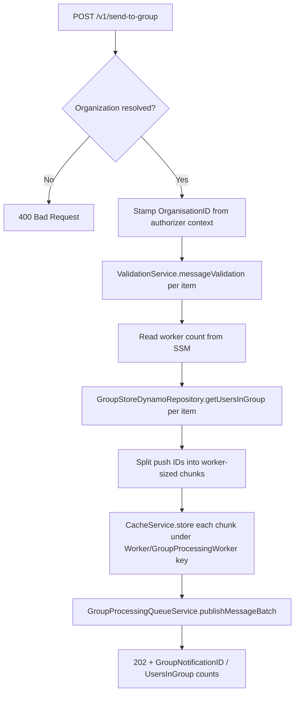

## PostGroupMessage

Feature-flagged (`config.featureFlag.groups` — infrastructure-level deployment gate) group-notification endpoint. Validates content, resolves group membership, chunks push IDs across workers, caches the chunks, and queues the work for downstream group processing.

- **Type:** HTTP (API Gateway)
- **Operation ID:** `postGroupMessage`
- **Route:** `POST /v1/send-to-group`

### Sample event

```json
{
  "requestContext": {
    "authorizer": {
      "Organization": "ORG01",
      "OrganisationConfig": "{\"MessageRetention\":{\"Allowed\":false},\"Channels\":[]}"
    },
    "requestId": "req-1",
    "requestTimeEpoch": 1428582896000
  },
  "body": [
    {
      "Namespace": "travel",
      "Group": "france",
      "Subgroup": "immediate",
      "GroupNotificationID": "TO_GROUP_ID",
      "CampaignID": "CAM_ID",
      "NotificationTitle": "You have a new Notification",
      "NotificationBody": "Here is the Notification body.",
      "MessageTitle": "You have a new Message",
      "MessageBody": "Open Notification Centre to read your notifications"
    }
  ]
}
```

### Infrastructure

- **DynamoDB** - `GroupStoreDynamoRepository` (the GroupStore table), read-only (`getUsersInGroup`).
- **ElastiCache (Redis)** - `CacheService` stores chunked push-ID lists for each worker under `Worker/GroupProcessingWorker/{GroupNotificationID}/{workerID}`.
- **SQS** - publishes batch metadata to the `groupprocessing` queue via `GroupProcessingQueueService.publishMessageBatch`.
- **SSM** - reads `SSMParameters.Group.Dispatch.WorkerCount` to determine how many worker chunks to create.
- Content is validated in-process by `ValidationService.messageValidation`, same as `postMessage`.

### Logic


