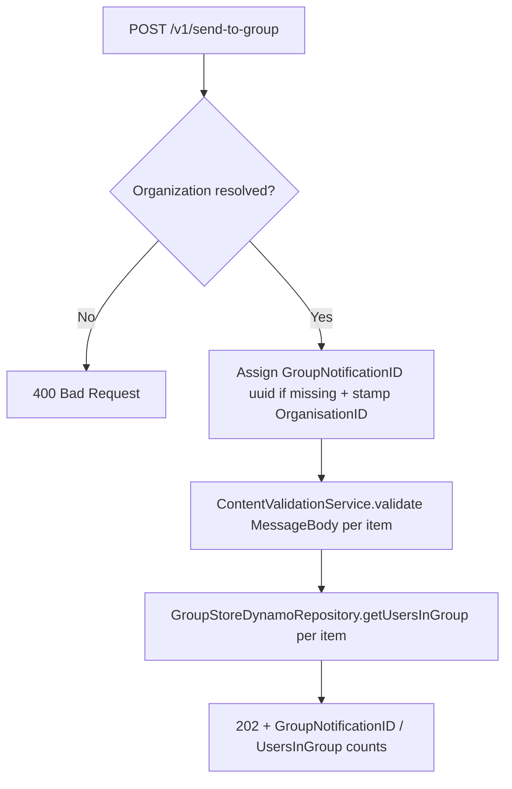

## PostGroupMessage

Feature-flagged (`config.featureFlag.groups`) group-notification endpoint. Validates content and resolves how many users currently belong to the target group/subgroup.

- **Type:** HTTP (API Gateway)
- **Operation ID:** `postGroupMessage`
- **Route:** `POST /v1/send-to-group`

### Sample event

```json
{
  "requestContext": { "authorizer": { "Organization": "ORG01" }, "requestId": "req-1" },
  "body": [
    {
      "Namespace": "travel",
      "Group": "france",
      "Subgroup": "immediate",
      "GroupNotificationID": "TO_GROUP_ID",
      "CampaignID": "CAM_ID",
      "NotificationTitle": "You have a new Notification",
      "NotificationBody": "Here is the Notification body.",
      "MessageTitle": "You have a new Message",
      "MessageBody": "Open Notification Centre to read your notifications"
    }
  ]
}
```

### Infrastructure

- **DynamoDB** - `GroupStoreDynamoRepository` (the GroupStore table); the current implementation only reads (`getUsersInGroup`).
- **IAM** grants this lambda `sqsSend` on the `groupprocessing` queue (see [`UNSPSOResources.ts`](../../../../infrastructure/cdk/constructs/UNSPSOResources.ts)), but **the current `implementation()` does not publish to any queue or write to DynamoDB** - it only resolves group membership counts and returns them. No group notification is actually queued, recorded, or dispatched yet.
- Content is validated in-process by `ContentValidationService`, same as `postMessage`.

### Logic


