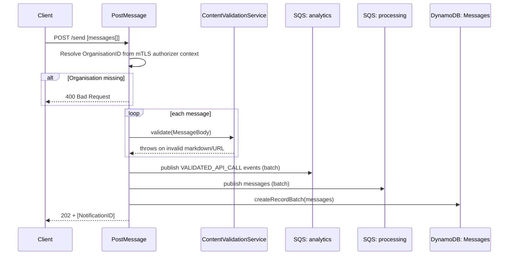

## PostMessage

Public ingestion endpoint for single-user notifications. Validates content, records the message, fires an analytics event, and hands it off to the `processing` queue for user-ID resolution and eventual dispatch.

- **Type:** HTTP (API Gateway)
- **Operation ID:** `postMessage`
- **Route:** `POST /send`

### Sample event

```json
{
  "body": "[{\"NotificationID\":\"200f6248-ed5b-4b73-be0b-4e9a2f8636e0\",\"DepartmentID\":\"DEP01\",\"UserID\":\"USER_ID\",\"CampaignID\":\"CAM_ID\",\"MessageTitle\":\"You have a new Message\",\"MessageBody\":\"Open Notification Centre to read your notifications\",\"NotificationTitle\":\"You have a new Notification\",\"NotificationBody\":\"Here is the Notification body.\"}]",
  "headers": { "Content-Type": "application/json" },
  "requestContext": {
    "requestId": "c6af9ac6-7b61-11e6-9a41-93e8deadbeef",
    "requestTimeEpoch": 1428582896000,
    "authorizer": { "Organization": "ORG01" }
  }
}
```

### Infrastructure

- **DynamoDB** - `NotificationsDynamoRepository` (the Messages table), read+write; writes a batch record per accepted message (`createRecordBatch`).
- **SQS** - publishes to the `processing` queue (batch) and, via `AnalyticsService`, to the `analytics` queue (`VALIDATED_API_CALL` event per message).
- Content is validated in-process by `ContentValidationService` (SSM-configured protocol/hostname allow-lists) - a failure here rejects the whole request with `400` before anything is written.
- This is one of two ingestion paths into the pipeline: `postMessage` writes directly to the Messages table and publishes straight to `processing`, in parallel to the queue-driven path that starts at [`sqs.validation`](../sqs.validation/README.md).

### Logic


