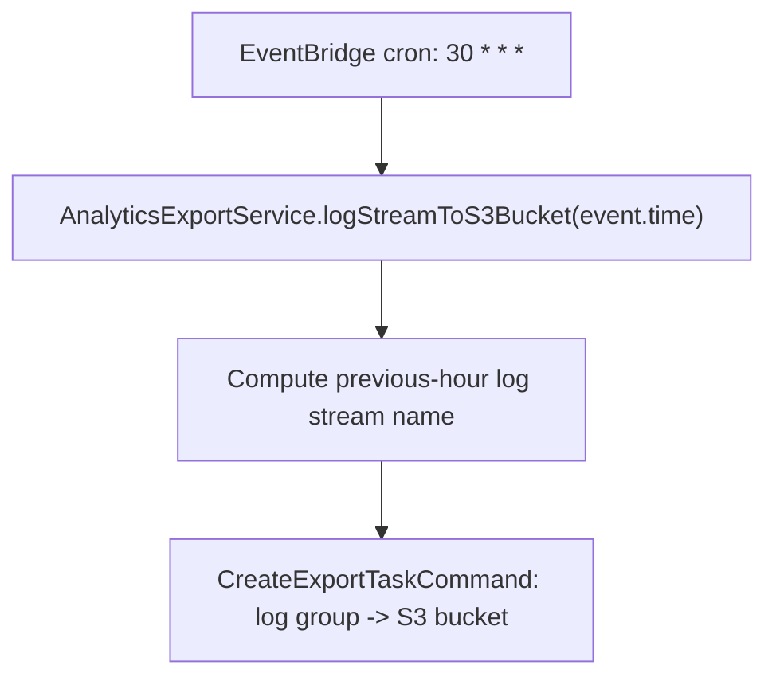

## AnalyticsExport

Hourly scheduled job that exports the previous hour's analytics CloudWatch log stream to S3, for downstream BigQuery ingestion.

- **Type:** EventBridge Scheduler
- **Operation ID:** `analyticsExport`
- **Schedule:** `cron(30 * * * ? *)` - every hour, at :30 (see [`UNSPSOResources.ts`](../../../../infrastructure/cdk/constructs/UNSPSOResources.ts))

### Sample event

```json
{
  "id": "cdc73f9d-aea9-11e3-9d5a-835b769c0d9c",
  "detail-type": "Scheduled Event",
  "source": "aws.events",
  "time": "2026-01-22T01:30:00Z",
  "resources": ["arn:aws:events:eu-west-2:123456789012:rule/analyticsExportSchedule"]
}
```

### Infrastructure

- **CloudWatch Logs** - `AnalyticsExportService.logStreamToS3Bucket` creates a `CreateExportTaskCommand` against the analytics export log group (written to by `sqs.analytics`).
- **S3** - destination bucket (`analyticsExportBucket`), lifecycle-expired after 7 days in production, or 1 day elsewhere.
- No DynamoDB or SQS involvement.

### Logic


