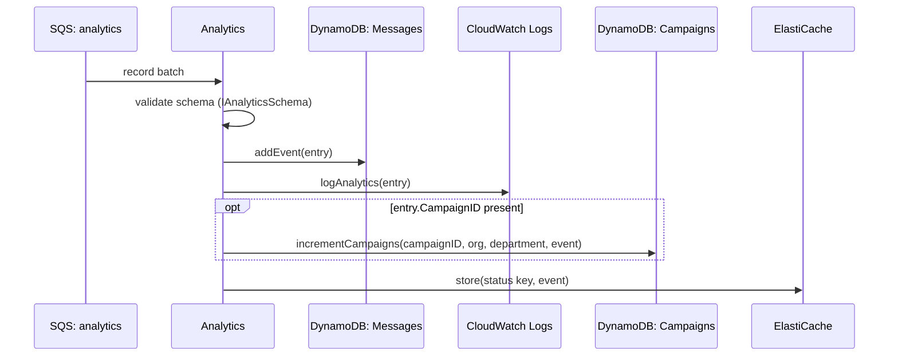

## Analytics

Terminal stage that fans events from every other stage into the notification's status history, campaign counters, cache, and long-term export storage. Every `AnalyticsService.publish*` call across the whole system ends up here.

- **Type:** SQS (batch, partial failure reporting)
- **Operation ID:** `analytics`
- No feature flag gate (`enableConfig` unset).

### Sample event

```json
{
  "Records": [
    {
      "messageId": "19dd0b57-b21e-4ac1-bd88-01bbb068cb78",
      "body": "{\"DepartmentID\":\"TEST01\",\"NotificationID\":\"not1\",\"EventID\":\"EVENT01\",\"Event\":\"VALIDATED\",\"EventDateTime\":\"2026-01-22T00:00:01Z\",\"APIGWExtendedID\":\"testExample\",\"CampaignID\":\"CAMP01\",\"EventReason\":\"testing\"}",
      "attributes": { "ApproximateReceiveCount": "1" },
      "eventSource": "aws:sqs"
    }
  ]
}
```

### Infrastructure

- **SQS in** - the `analytics` queue, written to by `postMessage`, `sqs.validation`, `sqs.processing`, `sqs.dispatch`, `patchNotification`, and `deleteNotification`.
- **DynamoDB** - `NotificationsDynamoRepository` (the Messages table, `addEvent` appends to the record's `Events` list) and `CampaignsDynamoRepository` (the Campaigns table, `incrementCampaigns` when `CampaignID` is present).
- **ElastiCache (Redis)** - `CacheService.store` caches the notification's latest status under `/{DepartmentID|OrganisationID}/{NotificationID}/Status`.
- **CloudWatch Logs** - `AnalyticsExportService.logAnalytics` writes a CSV line into the analytics export log group (later exported to S3 by `schedule.analyticsExport`).
- **VPC** - runs inside the private VPC subnets (needed for the ElastiCache connection).
- Does not publish to any further queue - this is the end of the chain, aside from the scheduled CloudWatch to S3 export.

### Logic


