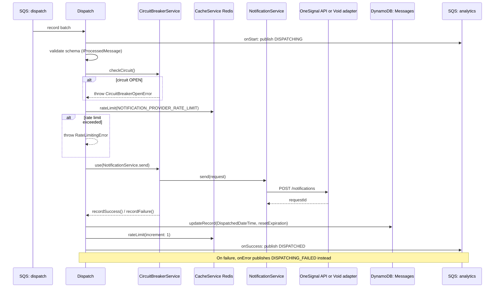

## Dispatch

Final delivery stage. Applies circuit-breaker + rate-limiting protection, then sends the push notification via the configured notification adapter (OneSignal or a no-op Void adapter).

- **Type:** SQS (batch, partial failure reporting)
- **Operation ID:** `dispatch`
- **Feature flag:** `BoolParameters.Config.Dispatch.Enabled`

### Sample event

```json
{
  "Records": [
    {
      "messageId": "mockMessageId",
      "body": "{\"NotificationID\":\"337f6248-ed5b-4b73-be0b-4e9a2f8636e0\",\"DepartmentID\":\"DEP01\",\"UserID\":\"test_id_01\",\"ExternalUserID\":\"test_id_01\",\"MessageTitle\":\"MOCK_LONG_TITLE\",\"MessageBody\":\"MOCK_LONG_MESSAGE\",\"NotificationTitle\":\"Hey\",\"NotificationBody\":\"You have a new message in the message center.\"}",
      "attributes": { "ApproximateReceiveCount": "2" },
      "eventSource": "aws:sqs"
    }
  ]
}
```

### Infrastructure

- **SQS in** - the `dispatch` queue (fed by `sqs.processing`).
- **SQS out** - via `AnalyticsService`, publishes to the `analytics` queue.
- **DynamoDB** - `NotificationsDynamoRepository` (the Messages table), read+write; stamps `DispatchedDateTime` and resets the record's TTL/expiration.
- **ElastiCache (Redis)** - `CacheService` backs both the per-minute provider rate limiter and `CircuitBreakerService`'s sliding-window state, keyed per platform (`notification_dispatch`).
- **Secrets Manager** - the OneSignal API key, read via `SMNamespacedConfigurationService`.
- **VPC** - runs inside the private VPC subnets (shared with `sqs.processing`).
- External call to the OneSignal push API (or no-op if the Void adapter is configured) - see [`NotificationAdapterOneSignal`](../../../common/services/adapters/notificationAdapterOneSignal.ts).

### Logic


