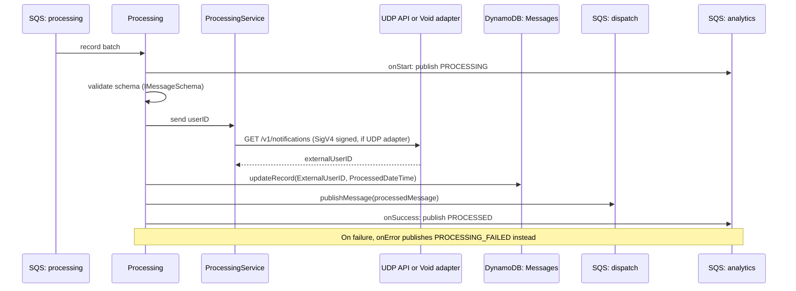

## Processing

Second pipeline stage. Resolves the message's `UserID` to a provider-specific `ExternalUserID` via the configured processing adapter (UDP or a no-op Void adapter), then forwards to `dispatch`.

- **Type:** SQS (batch, partial failure reporting)
- **Operation ID:** `processing`
- **Feature flag:** `BoolParameters.Config.Processing.Enabled`

### Sample event

```json
{
  "Records": [
    {
      "messageId": "mockMessageId",
      "body": "{\"NotificationID\":\"1234\",\"DepartmentID\":\"DEP01\",\"UserID\":\"UserID\",\"MessageTitle\":\"MOCK_LONG_TITLE\",\"MessageBody\":\"MOCK_LONG_MESSAGE\",\"NotificationTitle\":\"Hey\",\"NotificationBody\":\"You have a new message in the message center.\"}",
      "attributes": { "ApproximateReceiveCount": "2" },
      "eventSource": "aws:sqs"
    }
  ]
}
```

### Infrastructure

- **SQS in** - the `processing` queue (fed by both `postMessage` and `sqs.validation`).
- **SQS out** - publishes to the `dispatch` queue and, via `AnalyticsService`, the `analytics` queue.
- **DynamoDB** - `NotificationsDynamoRepository` (the Messages table), read+write; updates `ExternalUserID` + `ProcessedDateTime`.
- **VPC** - runs inside the private VPC subnets so it can reach the UDP service.
- **Secrets Manager / IAM `AssumeRole`** - when the `UDP` adapter is selected via SSM, `ProcessingAdapterUDP` assumes a cross-account role (`config.ssm.udp.role`) and reads UDP connection config from Secrets Manager (KMS-encrypted) to call UDP's API Gateway endpoint with SigV4 signing.
- See [`ProcessingService`/adapters](../../../common/services/README.md#service-classes--the-approaches-they-use) for the adapter-selection pattern.

### Logic


