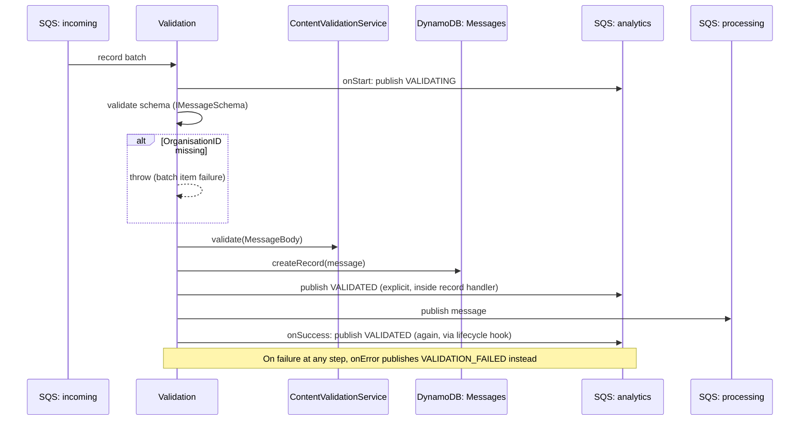

## Validation

First stage of the queue-driven ingestion path. Consumes raw messages from the `incoming` queue (populated by an external system outside this repo - see below), validates schema + content, records the notification, and forwards it to `processing`.

- **Type:** SQS (batch, partial failure reporting)
- **Operation ID:** `validation`
- **Feature flag:** `BoolParameters.Config.Validation.Enabled`

### Sample event

```json
{
  "Records": [
    {
      "messageId": "mockMessageId",
      "receiptHandle": "mockReceiptHandle",
      "body": "{\"NotificationID\":\"337f6248-ed5b-4b73-be1b-4e9a2f8636e0\",\"DepartmentID\":\"DEP01\",\"UserID\":\"test_id_01\",\"CampaignID\":\"CAM_ID\",\"MessageTitle\":\"MOCK_LONG_TITLE\",\"MessageBody\":\"MOCK_LONG_MESSAGE\",\"NotificationTitle\":\"Hey\",\"NotificationBody\":\"You have a new message in the message center.\"}",
      "attributes": { "ApproximateReceiveCount": "2" },
      "eventSource": "aws:sqs"
    }
  ]
}
```

### Infrastructure

- **SQS in** - the `incoming` queue. Unlike `postMessage`, nothing inside this repo publishes to `incoming` - it's fed by an external system (messages pushed from the portal), making this the second, asynchronous ingestion path into the pipeline (see [`postMessage`](../http.postMessage/README.md) for the synchronous HTTP path).
- **SQS out** - publishes each validated message to the `processing` queue, and analytics events to the `analytics` queue.
- **DynamoDB** - `NotificationsDynamoRepository` (the Messages table), write (`createRecord`). IAM also grants read/write on the Campaigns table, but this handler doesn't use `CampaignsDynamoRepository` directly.
- Content validated in-process via `ContentValidationService` (same allow-list rules as `postMessage`).

### Logic



A successful record currently publishes a `VALIDATED` analytics event twice - once explicitly inside `recordHandler`, and again from the `onSuccess` lifecycle hook.
